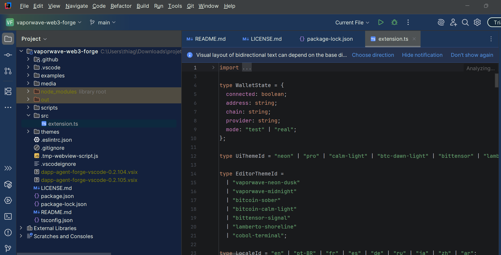

# IDEA Theme F1rst 🎨



[Português] | [English] | [Español] | [Deutsch] | [Polski] | [日本語] | [简体中文] | [Русский] | [Italiano] | [العربية]

---

## 🇧🇷 Português

Uma coleção de 7 temas vibrantes e de alta qualidade para IntelliJ IDEA e PyCharm. Calibrados para o conforto visual e produtividade do desenvolvedor.

### ✨ Temas Incluídos:
- **Theme F1rst**: Base profissional sólida com tons de azul e cinza. Inspirado na identidade digital F1rst.
- **Ubatuba Lamberto Beach**: Inspirado no pôr do sol em Ilhabela, com azuis oceânicos suaves e verdes montanhosos. Estética estilo Ghibli.
- **Bitcoin Tech**: Focado em tecnologia com laranja Bitcoin e cinza escuro suave. Ideal para Web3/Solidity.
- **Vaporwave Red Neon**: Base escura com magenta, vermelho e ciano neon.
- **Sky Garden**: Visual suave e ilustrado inspirado no Studio Ghibli.
- **Cowboy Terminal Black**: Visual retrô de terminal verde sobre preto.
- **Red Neon Future**: Estilo corporativo futurista com alto contraste.

---

## 🇺🇸 English

A collection of 7 vibrant and high-quality themes for IntelliJ IDEA and PyCharm. Calibrated for developer visual comfort and productivity.

### ✨ Included Themes:
- **Theme F1rst**: Solid professional base with blue and grey tones. Inspired by F1rst digital identity.
- **Ubatuba Lamberto Beach**: Inspired by a soft sunset in Ilhabela, with smooth ocean blues and mountain greens. Ghibli-style aesthetic.
- **Bitcoin Tech**: Tech-focused theme with Bitcoin orange and smooth dark grey. Ideal for Web3/Solidity.
- **Vaporwave Red Neon**: Dark base with neon magenta, red, and cyan.
- **Sky Garden**: Ghibli-inspired soft and illustrated look.
- **Cowboy Terminal Black**: Retro green-on-black terminal look.
- **Red Neon Future**: High contrast futuristic corporate style.

---

## 🇪🇸 Español

Una colección de 7 temas vibrantes y de alta calidad para IntelliJ IDEA y PyCharm. Calibrados para la comodidad visual y la productividad del desarrollador.

### ✨ Temas Incluidos:
- **Theme F1rst**: Base profesional sólida con tonos azules y grises. Inspirado en la identidad digital F1rst.
- **Ubatuba Lamberto Beach**: Inspirado en el atardecer en Ilhabela, con azules oceánicos suaves y verdes montañosos. Estética estilo Ghibli.
- **Bitcoin Tech**: Tema centrado en la tecnología con naranja Bitcoin y gris oscuro suave. Ideal para Web3/Solidity.
- **Vaporwave Red Neon**: Base oscura con magenta, rojo y cian neón.
- **Sky Garden**: Aspecto suave e ilustrado inspirado en Studio Ghibli.
- **Cowboy Terminal Black**: Aspecto de terminal retro verde sobre negro.
- **Red Neon Future**: Estilo corporativo futurista con alto contraste.

---

## 🇩🇪 Deutsch

Eine Sammlung von 7 lebendigen und hochwertigen Themes für IntelliJ IDEA und PyCharm. Optimiert für visuellen Komfort und Produktivität der Entwickler.

### ✨ Enthaltene Themes:
- **Theme F1rst**: Solide professionelle Basis mit Blau- und Grautönen. Inspiriert von der digitalen Identität von F1rst.
- **Ubatuba Lamberto Beach**: Inspiriert vom Sonnenuntergang in Ilhabela, mit sanften Meeresblau- und Bergrüntönen. Ghibli-Ästhetik.
- **Bitcoin Tech**: Technologie-fokussiertes Theme mit Bitcoin-Orange und sanftem Dunkelgrau. Ideal für Web3/Solidity.
- **Vaporwave Red Neon**: Dunkle Basis mit Neon-Magenta, Rot und Cyan.
- **Sky Garden**: Sanfter und illustrierter Look, inspiriert von Studio Ghibli.
- **Cowboy Terminal Black**: Retro-Terminal-Look (Grün auf Schwarz).
- **Red Neon Future**: Futuristischer Corporate-Stil mit hohem Kontrast.

---

## 🇵🇱 Polski

Kolekcja 7 dynamicznych i wysokiej jakości motywów dla IntelliJ IDEA i PyCharm. Skalibrowane dla komfortu wizualnego i produktywności programistów.

### ✨ Zawarte motywy:
- **Theme F1rst**: Solidna profesjonalna baza z odcieniami niebieskiego i szarości. Zainspirowany tożsamością cyfrową F1rst.
- **Ubatuba Lamberto Beach**: Zainspirowany zachodem słońca w Ilhabela, z miękkim morskim błękitem i górską zielenią. Estetyka w stylu Ghibli.
- **Bitcoin Tech**: Motyw skoncentrowany na technologii z pomarańczem Bitcoin i delikatną ciemną szarością. Idealny dla Web3/Solidity.
- **Vaporwave Red Neon**: Ciemna baza z neonowym magentą, czerwienią i cyjanem.
- **Sky Garden**: Miękki i ilustrowany wygląd inspirowany Studio Ghibli.
- **Cowboy Terminal Black**: Retro wygląd terminala (zielony na czarnym).
- **Red Neon Future**: Futurystyczny styl korporacyjny o wysokim kontraście.

---

## 🇯🇵 日本語

IntelliJ IDEA および PyCharm 用の、7 つの鮮やかで高品質なテーマのコレクション。開発者の視覚的な快適さと生産性のために調整されています。

### ✨ 含まれるテーマ:
- **Theme F1rst**: ブルーとグレーのトーンを基調とした、堅実でプロフェッショナルなベース。F1rst のデジタルアイデンティティにインスパイアされています。
- **Ubatuba Lamberto Beach**: イリャベラの夕日にインスパイアされた、柔らかな海辺の青と山の緑。ジブリ風の美学。
- **Bitcoin Tech**: ビットコインオレンジと落ち着いたダークグレーを基調としたテック向けテーマ。Web3/Solidity に最適。
- **Vaporwave Red Neon**: ネオンマゼンタ、レッド、シアンを使用したダークベース。
- **Sky Garden**: スタジオジブリにインスパイアされた、ソフトでイラストチックな外観。
- **Cowboy Terminal Black**: レトロな黒背景に緑文字のターミナル風。
- **Red Neon Future**: ハイコントラストな近未来コーポレートスタイル。

---

## 🇨🇳 简体中文

适用于 IntelliJ IDEA 和 PyCharm 的 7 种鲜艳且高质量主题的合集。专为开发者的视觉舒适度和生产力而优化。

### ✨ 包含的主题：
- **Theme F1rst**: 稳重的专业底色，配以蓝色和灰色调。灵感来自 F1rst 数字身份。
- **Ubatuba Lamberto Beach**: 受伊利亚贝拉日落启发，柔和的海蓝色和山绿色。吉卜力美学。
- **Bitcoin Tech**: 以技术为中心的主题，采用比特币橙和柔和深灰色。Web3/Solidity 开发的理想选择。
- **Vaporwave Red Neon**: 深色底色，配以霓虹洋红、红色和青色。
- **Sky Garden**: 受吉卜力工作室启发的柔和插画视觉效果。
- **Cowboy Terminal Black**: 复古的黑底绿字终端外观。
- **Red Neon Future**: 高对比度的未来主义企业风格。

---

## 🇷🇺 Русский

Коллекция из 7 ярких и высококачественных тем для IntelliJ IDEA и PyCharm. Оптимизированы для визуального комфорта и продуктивности разработчиков.

### ✨ Включенные темы:
- **Theme F1rst**: Солидная профессиональная база с синими и серыми тонами. Вдохновлена цифровой айдентикой F1rst.
- **Ubatuba Lamberto Beach**: Вдохновленный закатом в Ильябеле, с мягким морским синим и горным зеленым. Эстетика в стиле Гибли.
- **Bitcoin Tech**: Тема, ориентированная на технологии, с оранжевым цветом Bitcoin и мягким темно-серым. Идеально подходит для Web3/Solidity.
- **Vaporwave Red Neon**: Темная база с неоновым маджента, красным и синим.
- **Sky Garden**: Мягкий и иллюстрированный вид в стиле Studio Ghibli.
- **Cowboy Terminal Black**: Ретро-стиль терминала (зеленый на черном).
- **Red Neon Future**: Футуристический корпоративный стиль с высоким контрастом.

---

## 🇮🇹 Italiano

Una collezione di 7 temi vivaci e di alta qualità per IntelliJ IDEA e PyCharm. Calibrati per il comfort visivo e la produttività dello sviluppatore.

### ✨ Temi Inclusi:
- **Theme F1rst**: Solida base professionale con toni di blu e grigio. Ispirato all'identità digitale F1rst.
- **Ubatuba Lamberto Beach**: Ispirato al tramonto a Ilhabela, con tenui blu oceano e verdi montani. Estetica in stile Ghibli.
- **Bitcoin Tech**: Tema focalizzato sulla tecnologia con arancione Bitcoin e grigio scuro morbido. Ideale per Web3/Solidity.
- **Vaporwave Red Neon**: Base scura con neon magenta, rosso e ciano.
- **Sky Garden**: Look morbido e illustrato ispirato allo Studio Ghibli.
- **Cowboy Terminal Black**: Look terminale retrò verde su nero.
- **Red Neon Future**: Stile aziendale futuristico ad alto contrasto.

---

## 🇸🇦 العربية

مجموعة من 7 سمات حيوية وعالية الجودة لـ IntelliJ IDEA و PyCharm. تمت معايرتها لراحة المطور البصرية والإنتاجية.

### ✨ السمات المضمنة:
- **Theme F1rst**: قاعدة احترافية صلبة مع درجات اللون الأزرق والرمادي. مستوحى من الهوية الرقمية لـ F1rst.
- **Ubatuba Lamberto Beach**: مستوحى من غروب الشمس الهادئ في إلهابيلا، مع ألوان أزرق المحيط وأخضر الجبال الهادئة. جمالية بأسلوب جيبلي.
- **Bitcoin Tech**: مظهر يركز على التكنولوجيا مع لون البيتكوين البرتقالي والرمادي الداكن الناعم. مثالي لـ Web3/Solidity.
- **Vaporwave Red Neon**: قاعدة داكنة مع ألوان نيون أرجواني وأحمر وسماوي.
- **Sky Garden**: مظهر ناعم ورسومي مستوحى من استوديو جيبلي.
- **Cowboy Terminal Black**: مظهر طرفي قديم (أخضر على أسود).
- **Red Neon Future**: أسلوب مؤسسي مستقبلي بتباين عالٍ.

---

## 🚀 Como Publicar no Marketplace (JetBrains Marketplace)

1. **Crie uma conta**: Acesse [JetBrains Marketplace](https://plugins.jetbrains.com/) e faça login.
2. **Upload**: Clique em "Upload Plugin".
3. **Selecione o ZIP**: Escolha o arquivo em `dist/idea-theme-f1rst-0.9.0.zip`.
4. **Preencha os detalhes**: Adicione tags (Theme, UI), prints de tela e a descrição.
5. **Aguarde a aprovação**: A JetBrains revisará o plugin em alguns dias.

---

## 🛠 Desenvolvimento

Para gerar o pacote localmente:
```powershell
./scripts/build-theme.ps1
```
