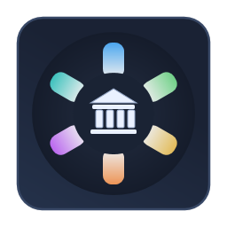

# BankingThemes

	

### Important

All themes are free artistic inspiration based on institutional visual language and are not official themes from any institution.

## Themes

- Santander Dark
- Santander Neon Black
- Santander Light
- COBOL Mainframe Dark
- COBOL Mainframe Light

Theme-only VS Code extension inspired by major Brazilian banks.

Now focused on Santander variants plus COBOL-optimized themes with strong readability for COBOL, Python, Java, Scala, PySpark, JavaScript and Solidity.

## Theme Picker by Subgroup

Open the Command Palette and run:

BankingThemes: Select Theme by Subgroup

This picker shows separator lines by subgroup.
