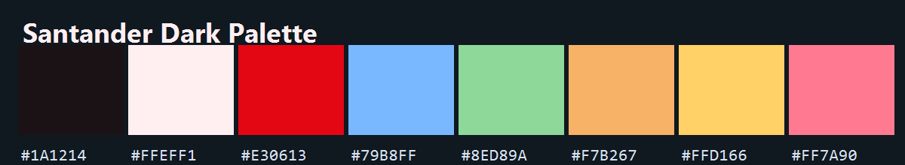
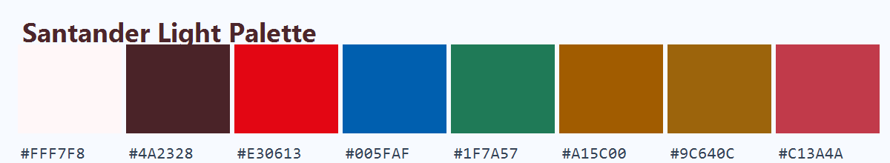
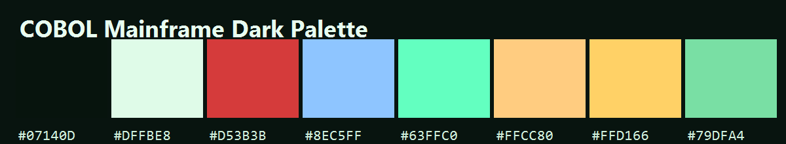
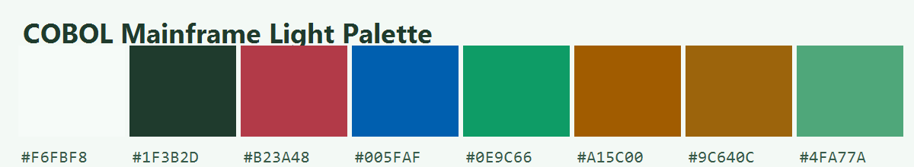

# BankingThemes

[](https://github.com/sponsors/ThiagoDataEngineer)

## Important

All themes are free artistic inspiration based on institutional visual language and are not official themes from any institution.

## Theme Palettes

### Santander Dark


### Santander Light


### COBOL Mainframe Dark


### COBOL Mainframe Light


Theme-only VS Code extension inspired by major Brazilian banks.

Now focused on Santander variants plus COBOL-optimized themes with strong readability for COBOL, Python, Java, Scala, PySpark, JavaScript and Solidity.

## Included Themes

This extension currently includes 4 themes.

Theme families by subgroup:

### Santander
- Santander

### COBOL Mainframe
- COBOL Mainframe

## Build VSIX

```bash
npm install
npm run package
```

## Theme Picker by Subgroup

Open the Command Palette and run:

BankingThemes: Select Theme by Subgroup

This picker shows separator lines by subgroup.
