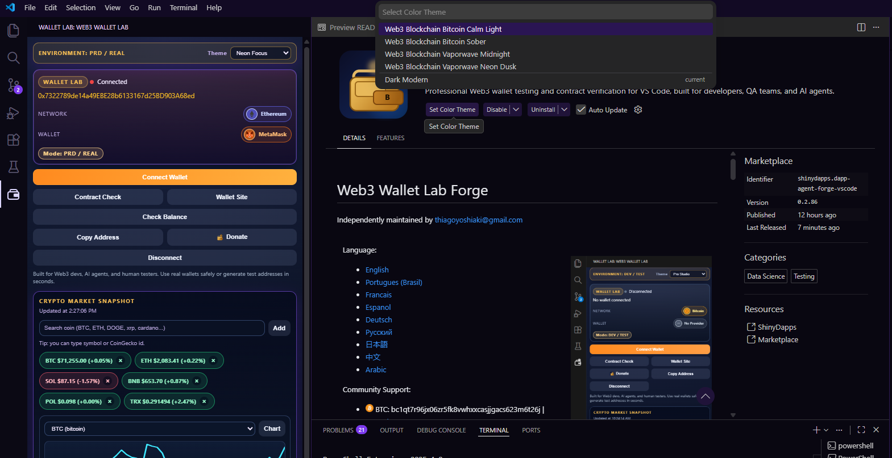

<h1>Web3 Wallet Lab Forge</h1>

### Language Selector

[English](#english) | [Portugues (Brasil)](#portugues-brasil) | [Francais](#francais) | [Espanol](#espanol) | [Deutsch](#deutsch) | [Русский](#русский) | [日本語](#日本語) | [中文](#中文) | [Arabic](#العربية)

This extension is multilanguage and includes full documentation in all listed languages.

  
   

### 100% Free Core Features (No Paywall)

- FREE themes for human users: Bitcoin Calm Light, Bitcoin Sober, Vaporwave Midnight, Vaporwave Neon Dusk, Bittensor Signal, Lamberto Ubatuba Beach, COBOL Terminal.
- FREE TEST mode for simulation and local validation flows.
- FREE Coin Market Snapshot with real-time prices and chart tracking.
- FREE Get Balance flow for supported networks in REAL mode.
- FREE public wallet validation (BTC, EVM, Solana...).
- FREE contract/code presence checks on supported EVM and Solana networks.
- FREE wallet registry with exportable records.

### AI Agent Consumption

- Can be consumed by AI agents as a service layer for wallet checks and market snapshots.
- Can be consumed as input (insumo) for agent pipelines, QA workflows, and report generation.
- Can be used as a practical reference for wallet-validation, balance-check, and contract-check routines.

Independently maintained by thiagoyoshiaki@gmail.com

## 💛 Sponsor & Community Support

Community Support

-  BTC: bc1qt7r96jx06zr5fk8vwhxxcasjjgacs623m6t26j | <a style="font-size:0.78em;" href="https://api.qrserver.com/v1/create-qr-code/?size=220x220&data=bitcoin%3Abc1qt7r96jx06zr5fk8vwhxxcasjjgacs623m6t26j">QRCode</a>
-  ETH: 0x7322789de14a49EBE28b6133167d25BD903A68ed | <a style="font-size:0.78em;" href="https://api.qrserver.com/v1/create-qr-code/?size=220x220&data=ethereum%3A0x7322789de14a49EBE28b6133167d25BD903A68ed">QRCode</a>
-  Solana: 9VmhYgzF3SVMfHJaPZfkjwQ22svxMf64fCcDoKyBFaSU | <a style="font-size:0.78em;" href="https://api.qrserver.com/v1/create-qr-code/?size=220x220&data=9VmhYgzF3SVMfHJaPZfkjwQ22svxMf64fCcDoKyBFaSU">QRCode</a>
-  Polygon: 0x7322789de14a49EBE28b6133167d25BD903A68ed | <a style="font-size:0.78em;" href="https://api.qrserver.com/v1/create-qr-code/?size=220x220&data=0x7322789de14a49EBE28b6133167d25BD903A68ed">QRCode</a>
-  Tron: TD23HKqyLdfms2GqySDu85ZyZTMEj3R37G | <a style="font-size:0.78em;" href="https://api.qrserver.com/v1/create-qr-code/?size=220x220&data=TD23HKqyLdfms2GqySDu85ZyZTMEj3R37G">QRCode</a>
- [GitHub Sponsors](https://github.com/ThiagoDataEngineer)

---

## English

### Overview

     

Web3 Wallet Lab Forge is a VS Code extension for wallet validation, contract verification, real balance checks, and crypto market tracking across Bitcoin, EVM chains, and Solana.

### Why Install

- Reduce wallet validation mistakes before testing, audit, or reporting flows.
- Run contract/code checks directly in-editor without switching context.
- Track live balances and monitor market movement with quick operational signals.
- Keep a wallet registry with exportable records for QA and team operations.

### What You Can Do

- Public wallet address validation (BTC, EVM, Solana).
- Contract/code presence checks on supported EVM and Solana networks.
- REAL mode live balance checks and TEST mode simulation flow.
- Real-time crypto bubble prices and chart monitoring.
- Built-in free themes for human users.
- Wallet registry with your own public keys and balance history export.

### Included Themes

- Web3 Blockchain Vaporwave Neon Dusk
- Web3 Blockchain Vaporwave Midnight
- Web3 Blockchain Bittensor Signal
- Web3 Blockchain Lamberto Ubatuba Beach
- Web3 Blockchain COBOL Terminal
- Web3 Blockchain Bitcoin Sober
- Web3 Blockchain Bitcoin Calm Light

### Quick Start

1. Install from VS Code Marketplace.
2. Open Wallet Lab and choose TEST or REAL mode. As soon as it opens, you can already follow the live chart and prices.
3. Run your first wallet validation and balance check.

### Security Model

- Public addresses only.
- No private keys, seed phrases, or signing secrets.
- REAL mode reads from public RPC/indexer and market endpoints.

### Known Limitations

- Data freshness depends on provider availability and network conditions.
- Contract check works only on supported EVM and Solana networks.
- Bitcoin currently supports balance check workflows only.

---

## Portugues (Brasil)

### Visao Geral

     

Web3 Wallet Lab Forge e uma extensao VS Code para validacao de carteiras, verificacao de contratos, checagem de saldos reais e acompanhamento de mercado cripto em Bitcoin, cadeias EVM e Solana.

### Por Que Instalar

- Reduz erros de validacao de carteira antes de testes, auditoria e report.
- Executa verificacoes de contrato/codigo dentro do editor, sem troca de contexto.
- Permite acompanhar saldo real e movimento de mercado com sinais operacionais rapidos.
- Mantem registro de carteiras com exportacao para rotinas de QA e operacao.

### What You Can Do

- Validacao de endereco publico de carteira (BTC, EVM, Solana).
- Verificacao de presenca de contrato/codigo nas redes EVM e Solana suportadas.
- Checagem de saldo ao vivo no modo REAL e fluxo de simulacao no modo TEST.
- Monitoramento de bubble prices e grafico cripto em tempo real.
- Temas gratuitos integrados para usuarios humanos.
- Registro de carteiras com suas chaves publicas e exportacao de historico de saldos.

### Temas Inclusos

- Web3 Blockchain Vaporwave Neon Dusk
- Web3 Blockchain Vaporwave Midnight
- Web3 Blockchain Bittensor Signal
- Web3 Blockchain Lamberto Ubatuba Beach
- Web3 Blockchain COBOL Terminal
- Web3 Blockchain Bitcoin Sober
- Web3 Blockchain Bitcoin Calm Light

### Quick Start

1. Instale pela VS Code Marketplace.
2. Abra o Wallet Lab e escolha modo TEST ou REAL. Ao abrir, voce ja acompanha grafico e precos ao vivo.
3. Execute sua primeira validacao de carteira e checagem de saldo.

### Modelo de Seguranca

- Somente enderecos publicos.
- Sem chaves privadas, seed phrases ou segredos de assinatura.
- O modo REAL consulta endpoints publicos de RPC/indexer e dados de mercado.

### Limitacoes Conhecidas

- Atualizacao dos dados depende da disponibilidade dos provedores e da rede.
- Contract check funciona apenas em redes EVM e Solana suportadas.
- Bitcoin atualmente suporta apenas fluxo de balance check.

---

## Francais

### Vue d'ensemble

     

Web3 Wallet Lab Forge est une extension VS Code pour la validation de portefeuilles, la verification de contrats, le controle des soldes reels et le suivi du marche crypto sur Bitcoin, les chaines EVM et Solana.

### Pourquoi Installer

- Reduire les erreurs de validation avant les tests, audits et rapports.
- Verifier contrat/code directement dans l'editeur, sans changer de contexte.
- Suivre le solde reel et le mouvement du marche avec des signaux rapides.
- Maintenir un registre de portefeuilles exportable pour QA et operations.

### What You Can Do

- Validation d'adresse publique de portefeuille (BTC, EVM, Solana).
- Verification de presence de contrat/code sur les reseaux EVM et Solana supportes.
- Verification de solde en direct en mode REAL et simulation en mode TEST.
- Suivi en temps reel des bubble prices et du graphique crypto.
- Themes gratuits integres pour utilisateurs humains.
- Registre de portefeuilles avec vos cles publiques et export d'historique des soldes.

### Themes Inclus

- Web3 Blockchain Vaporwave Neon Dusk
- Web3 Blockchain Vaporwave Midnight
- Web3 Blockchain Bittensor Signal
- Web3 Blockchain Lamberto Ubatuba Beach
- Web3 Blockchain COBOL Terminal
- Web3 Blockchain Bitcoin Sober
- Web3 Blockchain Bitcoin Calm Light

### Quick Start

1. Installez depuis le VS Code Marketplace.
2. Ouvrez Wallet Lab et choisissez le mode TEST ou REAL. Des l'ouverture, vous pouvez deja suivre le graphique et les prix en direct.
3. Lancez votre premiere validation de portefeuille et verification de solde.

### Modele de Securite

- Adresses publiques uniquement.
- Aucune cle privee, phrase seed ou secret de signature.
- Le mode REAL lit les endpoints publics RPC/indexer et marche.

### Limitations Connues

- La fraicheur des donnees depend des providers et du reseau.
- Contract check fonctionne seulement sur les reseaux EVM/Solana supportes.
- Bitcoin prend en charge uniquement le flux balance check pour le moment.

---

## Espanol

### Vision General

     

Web3 Wallet Lab Forge es una extension de VS Code para validacion de billeteras, verificacion de contratos, chequeo de saldos reales y seguimiento de mercado cripto en Bitcoin, redes EVM y Solana.

### Por Que Instalar

- Reduce errores de validacion antes de pruebas, auditorias y reportes.
- Ejecuta chequeos de contrato/codigo dentro del editor sin cambiar de contexto.
- Permite seguir saldo real y movimiento del mercado con senales rapidas.
- Mantiene un registro de billeteras exportable para QA y operacion.

### What You Can Do

- Validacion de direccion publica de billetera (BTC, EVM, Solana).
- Verificacion de presencia de contrato/codigo en redes EVM y Solana compatibles.
- Consulta de saldo en vivo en modo REAL y flujo de simulacion en modo TEST.
- Monitoreo en tiempo real de bubble prices y grafico cripto.
- Temas gratuitos integrados para usuarios humanos.
- Registro de billeteras con tus claves publicas y exportacion de historial de saldos.

### Temas Incluidos

- Web3 Blockchain Vaporwave Neon Dusk
- Web3 Blockchain Vaporwave Midnight
- Web3 Blockchain Bittensor Signal
- Web3 Blockchain Lamberto Ubatuba Beach
- Web3 Blockchain COBOL Terminal
- Web3 Blockchain Bitcoin Sober
- Web3 Blockchain Bitcoin Calm Light

### Quick Start

1. Instala desde VS Code Marketplace.
2. Abre Wallet Lab y elige modo TEST o REAL. Al abrir, ya puedes seguir grafico y precios en vivo.
3. Ejecuta tu primera validacion de billetera y consulta de saldo.

### Modelo de Seguridad

- Solo direcciones publicas.
- Sin llaves privadas, seed phrases ni secretos de firma.
- El modo REAL consulta endpoints publicos de RPC/indexer y mercado.

### Limitaciones Conocidas

- La frescura de datos depende de los proveedores y de la red.
- Contract check funciona solo en redes EVM/Solana soportadas.
- Bitcoin actualmente soporta solo flujo de balance check.

---

## Deutsch

### Uebersicht

     

Web3 Wallet Lab Forge ist eine VS Code-Erweiterung fuer Wallet-Validierung, Vertragspruefung, reale Saldoabfragen und Krypto-Marktbeobachtung auf Bitcoin, EVM-Chains und Solana.

### Warum Installieren

- Reduziert Validierungsfehler vor Tests, Audit und Reporting.
- Prueft Contract/Code direkt im Editor ohne Kontextwechsel.
- Verfolgt reale Salden und Marktbewegung mit schnellen Signalen.
- Fuehrt ein exportierbares Wallet-Register fuer QA und Betrieb.

### What You Can Do

- Validierung oeffentlicher Wallet-Adressen (BTC, EVM, Solana).
- Pruefung auf vorhandenen Contract/Code in unterstuetzten EVM- und Solana-Netzwerken.
- Live-Saldoabfragen im REAL-Modus und Simulationsfluss im TEST-Modus.
- Echtzeit-Tracking von Krypto-Bubble-Prices und Chart.
- Integrierte kostenlose Themes fuer menschliche Nutzer.
- Wallet-Register mit eigenen Public Keys und Export des Saldoverlaufs.

### Enthaltene Themes

- Web3 Blockchain Vaporwave Neon Dusk
- Web3 Blockchain Vaporwave Midnight
- Web3 Blockchain Bittensor Signal
- Web3 Blockchain Lamberto Ubatuba Beach
- Web3 Blockchain COBOL Terminal
- Web3 Blockchain Bitcoin Sober
- Web3 Blockchain Bitcoin Calm Light

### Quick Start

1. Im VS Code Marketplace installieren.
2. Wallet Lab oeffnen und TEST oder REAL waehlen. Beim Oeffnen koennen Sie bereits Chart und Preise live verfolgen.
3. Erste Wallet-Validierung und Saldo-Pruefung ausfuehren.

### Sicherheitsmodell

- Nur oeffentliche Adressen.
- Keine Private Keys, Seed-Phrases oder Signatur-Geheimnisse.
- REAL-Modus liest von oeffentlichen RPC/indexer- und Markt-Endpunkten.

### Bekannte Einschraenkungen

- Datenaktualitaet haengt von Providern und Netzbedingungen ab.
- Contract check funktioniert nur in unterstuetzten EVM/Solana-Netzwerken.
- Bitcoin unterstuetzt derzeit nur Balance-Check-Workflows.

---

## Русский

### Обзор

     

Web3 Wallet Lab Forge - это расширение VS Code для валидации кошельков, проверки контрактов, проверки реальных балансов и мониторинга крипторынка в Bitcoin, EVM-сетях и Solana.

### Зачем Устанавливать

- Снижает ошибки валидации перед тестами, аудитом и отчетностью.
- Выполняет проверку контракта/кода прямо в редакторе без смены контекста.
- Позволяет отслеживать реальный баланс и движение рынка по быстрым сигналам.
- Ведет экспортируемый реестр кошельков для QA и операционной работы.

### What You Can Do

- Валидация публичного адреса кошелька (BTC, EVM, Solana).
- Проверка наличия контракта/кода в поддерживаемых сетях EVM и Solana.
- Проверка баланса в реальном времени в режиме REAL и симуляция в режиме TEST.
- Мониторинг crypto bubble prices и графика в реальном времени.
- Встроенные бесплатные темы для пользователей.
- Реестр кошельков с вашими публичными ключами и экспортом истории балансов.

### Включенные Темы

- Web3 Blockchain Vaporwave Neon Dusk
- Web3 Blockchain Vaporwave Midnight
- Web3 Blockchain Bittensor Signal
- Web3 Blockchain Lamberto Ubatuba Beach
- Web3 Blockchain COBOL Terminal
- Web3 Blockchain Bitcoin Sober
- Web3 Blockchain Bitcoin Calm Light

### Quick Start

1. Установите из VS Code Marketplace.
2. Откройте Wallet Lab и выберите TEST или REAL. Сразу после открытия можно отслеживать график и цены вживую.
3. Выполните первую проверку адреса кошелька и баланса.

### Модель Безопасности

- Только публичные адреса.
- Без приватных ключей, seed phrase и секретов подписи.
- Режим REAL читает публичные RPC/indexer и рыночные endpoints.

### Известные Ограничения

- Актуальность данных зависит от провайдера и состояния сети.
- Contract check работает только в поддерживаемых сетях EVM/Solana.
- Bitcoin пока поддерживает только сценарии balance check.

---

## 日本語

### 概要

     

Web3 Wallet Lab Forge は、Bitcoin、EVM、Solana を対象に、ウォレット検証、コントラクト確認、実残高チェック、暗号市場モニタリングを行える VS Code 拡張です。

### 導入する理由

- テスト、監査、レポート前の検証ミスを削減できます。
- エディタ内で契約/コード確認ができ、コンテキスト切替を減らせます。
- 実残高と市場の動きを、素早いシグナルとして追跡できます。
- QA と運用向けに、エクスポート可能なウォレット登録を維持できます。

### What You Can Do

- 公開ウォレットアドレスの検証 (BTC, EVM, Solana)。
- 対応する EVM / Solana ネットワークでのコントラクト/コード存在チェック。
- REAL モードでのライブ残高確認と TEST モードでのシミュレーション。
- crypto bubble prices とチャートのリアルタイム監視。
- 人間ユーザー向けの無料内蔵テーマ。
- 公開鍵と残高履歴を管理できるウォレットレジストリ。

### 同梱テーマ

- Web3 Blockchain Vaporwave Neon Dusk
- Web3 Blockchain Vaporwave Midnight
- Web3 Blockchain Bittensor Signal
- Web3 Blockchain Lamberto Ubatuba Beach
- Web3 Blockchain COBOL Terminal
- Web3 Blockchain Bitcoin Sober
- Web3 Blockchain Bitcoin Calm Light

### Quick Start

1. VS Code Marketplace からインストールします。
2. Wallet Lab を開いて TEST または REAL を選択します。開いた直後からチャートと価格をリアルタイムで確認できます。
3. 最初のウォレット検証と残高チェックを実行します。

### セキュリティモデル

- 公開アドレスのみを扱います。
- 秘密鍵、seed phrase、署名シークレットは扱いません。
- REAL モードは公開 RPC/indexer と市場データ endpoint を参照します。

### 既知の制限

- データの鮮度はプロバイダーとネットワーク状態に依存します。
- Contract check は対応する EVM/Solana ネットワークのみで動作します。
- Bitcoin は現在 balance check 系フローのみ対応です。

---

## 中文

### 概述

     

Web3 Wallet Lab Forge 是一个 VS Code 扩展，支持在 Bitcoin、EVM、Solana 上进行钱包校验、合约检查、真实余额查询与加密市场跟踪。

### 为什么安装

- 降低测试、审计、报告前的钱包校验错误。
- 在编辑器内完成合约/代码检查，减少上下文切换。
- 通过快速信号跟踪真实余额和市场变化。
- 维护可导出的钱包注册记录，方便 QA 与运营流程。

### What You Can Do

- 公共钱包地址校验 (BTC, EVM, Solana)。
- 在支持的 EVM 与 Solana 网络进行合约/代码存在性检查。
- REAL 模式实时余额检查与 TEST 模式模拟流程。
- 实时监控 crypto bubble prices 与图表。
- 面向人类用户的内置免费主题。
- 钱包注册表，支持你的公钥与余额历史导出。

### 内置主题

- Web3 Blockchain Vaporwave Neon Dusk
- Web3 Blockchain Vaporwave Midnight
- Web3 Blockchain Bittensor Signal
- Web3 Blockchain Lamberto Ubatuba Beach
- Web3 Blockchain COBOL Terminal
- Web3 Blockchain Bitcoin Sober
- Web3 Blockchain Bitcoin Calm Light

### Quick Start

1. 从 VS Code Marketplace 安装。
2. 打开 Wallet Lab 并选择 TEST 或 REAL 模式。打开后即可直接查看实时图表和价格。
3. 运行你的首次钱包校验与余额检查。

### 安全模型

- 仅处理公共地址。
- 不处理私钥、seed phrase 或签名密钥。
- REAL 模式读取公开 RPC/indexer 与市场数据 endpoints。

### 已知限制

- 数据新鲜度取决于提供商可用性与网络状态。
- Contract check 仅在受支持的 EVM/Solana 网络可用。
- Bitcoin 当前仅支持 balance check 类流程。

---

## العربية

### نظرة عامة

     

Web3 Wallet Lab Forge هي اضافة VS Code للتحقق من المحافظ، وفحص العقود، ومراجعة الارصدة الحقيقية، ومتابعة سوق الكريبتو عبر Bitcoin وEVM وSolana.

### لماذا التثبيت

- تقلل اخطاء التحقق قبل الاختبار والتدقيق والتقارير.
- تنفذ فحص العقد/الكود داخل المحرر بدون تغيير السياق.
- تتيح متابعة الرصيد الحقيقي وحركة السوق عبر اشارات سريعة.
- توفر سجل محافظ قابل للتصدير لسيناريوهات QA والتشغيل.

### What You Can Do

- التحقق من عنوان محفظة عام (BTC, EVM, Solana).
- فحص وجود العقد/الكود على شبكات EVM و Solana المدعومة.
- فحص رصيد مباشر في وضع REAL مع تدفق محاكاة في وضع TEST.
- متابعة crypto bubble prices والرسم البياني بشكل فوري.
- ثيمات مجانية مدمجة للمستخدمين.
- سجل محافظ بمفاتيحك العامة مع تصدير تاريخ الارصدة.

### الثيمات المضمنة

- Web3 Blockchain Vaporwave Neon Dusk
- Web3 Blockchain Vaporwave Midnight
- Web3 Blockchain Bittensor Signal
- Web3 Blockchain Lamberto Ubatuba Beach
- Web3 Blockchain COBOL Terminal
- Web3 Blockchain Bitcoin Sober
- Web3 Blockchain Bitcoin Calm Light

### Quick Start

1. ثبّت الاضافة من VS Code Marketplace.
2. افتح Wallet Lab واختر وضع TEST او REAL. بمجرد الفتح يمكنك متابعة الرسم البياني والاسعار مباشرة.
3. نفّذ اول تحقق للمحفظة وفحص الرصيد.

### نموذج الامان

- يدعم العناوين العامة فقط.
- بدون مفاتيح خاصة او seed phrase او اسرار توقيع.
- وضع REAL يقرأ من endpoints عامة لـ RPC/indexer وبيانات السوق.

### القيود المعروفة

- حداثة البيانات تعتمد على توفر المزود وحالة الشبكة.
- Contract check يعمل فقط على شبكات EVM/Solana المدعومة.
- Bitcoin يدعم حاليا تدفقات balance check فقط.

