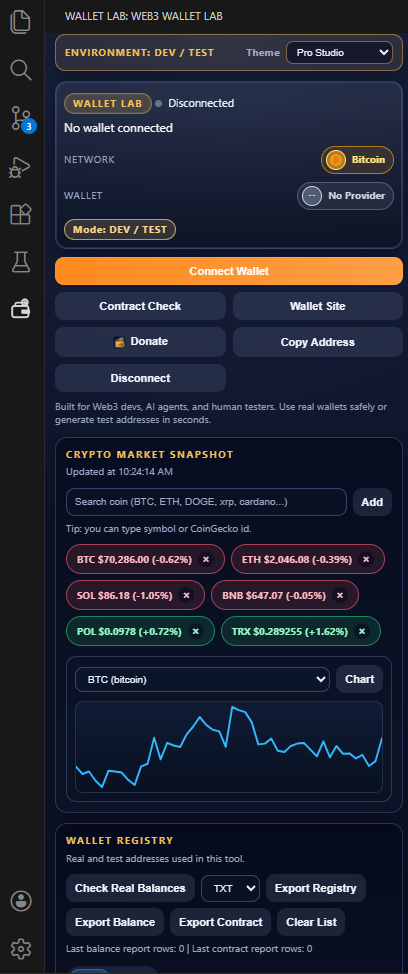
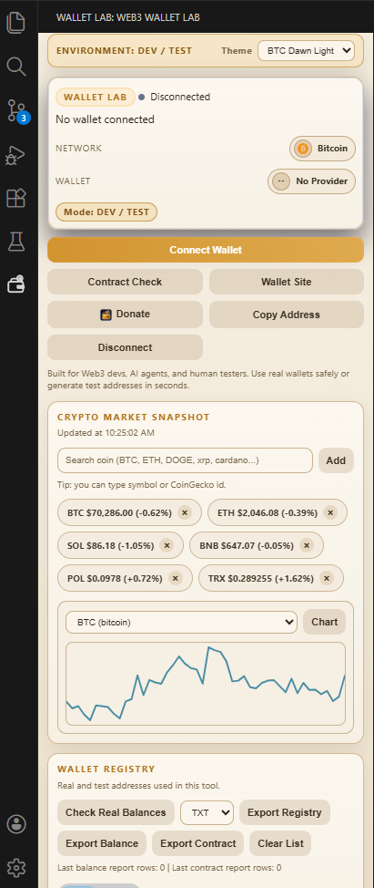
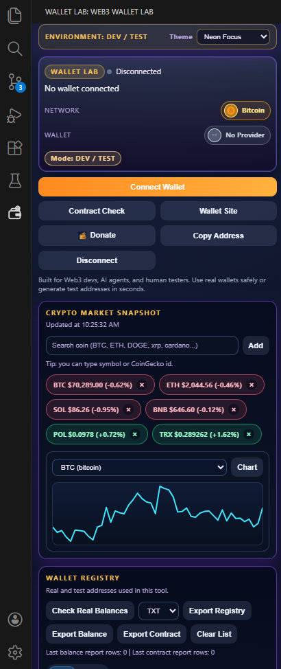
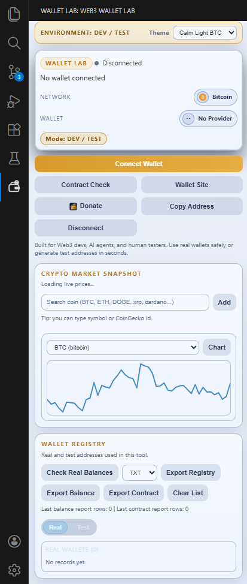

# Web3 Wallet Lab Forge

Created by thiagoyoshiaki@gmail.com

## Preview

<p align="center">
	
	
</p>
<p align="center">
	
	
</p>

Language:
- [English](#english)
- [Portugues (Brasil)](#portugues-brasil)
- [Francais](#francais)
- [Espanol](#espanol)
- [Deutsch](#deutsch)
- [Русский](#русский)
- [日本語](#日本語)
- [中文](#中文)
- [Arabic](#العربية)

---

## English

### Overview

Web3 Wallet Lab Forge is a practical VS Code extension for wallet testing, contract verification, real-balance intelligence, and crypto bubble prices visualization across Bitcoin, major EVM chains, and Solana.

### Highlights

- 🛰️ Real wallet mode with public address validation.
- 🧪 Test wallet generation mode for local workflows.
- 🌌 Built-in theme system (dark + light) for different working styles.
- ₿ Bitcoin-first network selection (Mainnet and Testnet).
- ⚡ Provider shortcuts for major wallets.
- 📜 Contract check for major EVM and Solana chains.
- 🪙 Real balance lookup via RPC/indexer APIs.
- 📤 Registry export for operational records (TXT/CSV).

### Contract Check Network Coverage

Bitcoin networks currently support Balance Check only.

- EVM Mainnets: Ethereum, BNB Smart Chain, Polygon, Arbitrum, Optimism, Base, Avalanche, Fantom, Gnosis, Linea, zkSync Era.
- EVM Testnets: Ethereum Sepolia, Base Sepolia, Polygon Amoy.
- Solana: Mainnet RPC flow.

### Supported Providers

MetaMask, Coinbase Wallet, Trust Wallet, Binance Wallet, Uniswap Wallet, Phantom, WalletConnect, Ledger Live, Trezor Suite, OKX Wallet, Rainbow, Rabby, Safe Wallet, Zerion, Xverse, Unisat, Leather, Electrum, Backpack.

### Quick Start

```bash
npm install
npm run compile
```

Press F5 in VS Code to launch the Extension Development Host.

### Usage

1. Click Connect Wallet and choose REAL mode or TEST mode.
2. Select network and provider.
3. Paste a public wallet address (BTC, EVM, or Solana).
4. Run Contract Check to validate deployment/code presence.
5. In REAL mode, use Check Balance for live lookup.
6. In Crypto Market Snapshot, add extra coins by symbol/id (example: DOGE, XRP, cardano).
7. Use the chart selector to view BTC or another selected asset trend.
8. In Wallet Registry, run Check Real Balances and export reports.

### Reuse as dApp Starter

1. Clone this repository.
2. Keep agent conventions under .github.
3. Run the prompt at .github/prompts/new-dapp-from-forge.prompt.md in Copilot Chat.
4. Request your target stack (example: Next.js + wagmi + viem).
5. Keep wallet safety rules: public addresses only, never seed/private keys.

### Donate

-  BTC: <span style="color:#facc15;font-size:0.92em;">bc1qt7r96jx06zr5fk8vwhxxcasjjgacs623m6t26j</span>
-  ETH: <span style="color:#facc15;font-size:0.92em;">0x7322789de14a49EBE28b6133167d25BD903A68ed</span>
-  Solana: <span style="color:#facc15;font-size:0.92em;">9VmhYgzF3SVMfHJaPZfkjwQ22svxMf64fCcDoKyBFaSU</span>
-  Polygon: <span style="color:#facc15;font-size:0.92em;">0x7322789de14a49EBE28b6133167d25BD903A68ed</span>
-  Tron: <span style="color:#facc15;font-size:0.92em;">TD23HKqyLdfms2GqySDu85ZyZTMEj3R37G</span>
- [GitHub Sponsors](https://github.com/ThiagoDataEngineer)

### Intellectual Property

- The extension icon files (media/icon.png and media/activity-icon.svg) and visual identity are reserved for this project unless explicitly authorized by the author.
- The name, brand, and visual assets are all rights reserved.
- This repository does not grant commercial usage rights for the product identity without prior permission.

---

## Portugues (Brasil)

### Visao Geral

Web3 Wallet Lab Forge e uma extensao para VS Code focada em prototipagem rapida de dApps com fluxos de carteira seguros, validacao de contratos, inteligencia de saldo e visualizacao de bubble prices cripto para Bitcoin, redes EVM e Solana.

### Destaques

- 🛰️ Modo carteira real com validacao de endereco publico.
- 🧪 Modo carteira de teste para fluxo local.
- 🌌 Sistema de temas integrado (dark + light) para diferentes estilos de trabalho.
- ₿ Selecao de rede com Bitcoin primeiro (Mainnet e Testnet).
- ⚡ Atalhos para sites de provedores de carteira.
- 📜 Contract Check para principais cadeias EVM e Solana.
- 🪙 Consulta de saldo real por RPC/indexer.
- 📤 Exportacao de registros e relatorios (TXT/CSV).

---

## Francais

### Vue d'ensemble

Web3 Wallet Lab Forge est une extension VS Code pour tester des portefeuilles, verifier contrats/soldes et visualiser les bubble prices crypto sur Bitcoin, les chaines EVM et Solana.

### Points Forts

- 🛰️ Mode portefeuille reel avec validation d'adresse publique.
- 🧪 Mode portefeuille de test pour les workflows locaux.
- 🌌 Systeme de themes integre (dark + light) pour differents styles de travail.
- ₿ Selection de reseau orientee Bitcoin (Mainnet et Testnet).
- ⚡ Raccourcis vers les principaux fournisseurs de portefeuilles.
- 📜 Verification de contrat pour les chaines EVM et Solana.

---

## Espanol

### Vision General

Web3 Wallet Lab Forge es una extension de VS Code para pruebas de billeteras, verificaciones de contrato/saldo y visualizacion de bubble prices cripto en Bitcoin, cadenas EVM y Solana.

### Puntos Destacados

- 🛰️ Modo billetera real con validacion de direccion publica.
- 🧪 Modo billetera de prueba para flujos locales.
- 🌌 Sistema de temas integrado (dark + light) para distintos estilos de trabajo.
- ₿ Seleccion de red con enfoque Bitcoin (Mainnet y Testnet).
- ⚡ Atajos a proveedores principales de billetera.
- 📜 Verificacion de contrato para cadenas EVM y Solana.
- 🪙 Consulta de saldo real via APIs RPC/indexer.

---

## Deutsch

### Ubersicht

Web3 Wallet Lab Forge ist eine VS Code-Erweiterung fur Wallet-Tests, Vertrags-/Saldo-Prufungen und die Visualisierung von Krypto-Bubble-Prices auf Bitcoin, EVM-Chains und Solana.

### Highlights

- 🛰️ Echter Wallet-Modus mit Validierung offentlich sichtbarer Adressen.
- 🧪 Test-Wallet-Generierungsmodus fur lokale Workflows.
- 🌌 Integriertes Theme-System (dark + light) fur verschiedene Arbeitsstile.
- ₿ Bitcoin-zentrierte Netzwerkauswahl (Mainnet und Testnet).
- ⚡ Schnellzugriffe auf wichtige Wallet-Anbieter.
- 📜 Contract Check fur wichtige EVM- und Solana-Chains.
- 🪙 Reale Saldoabfrage uber RPC-/Indexer-APIs.

---

## Русский

### Обзор

Web3 Wallet Lab Forge - это расширение VS Code для тестирования кошельков, проверки контрактов/балансов и визуализации crypto bubble prices в сетях Bitcoin, EVM и Solana.

### Основные Возможности

- 🛰️ Режим реального кошелька с проверкой публичного адреса.
- 🧪 Режим тестового кошелька для локальных сценариев.
- 🌌 Встроенная система тем (dark + light) для разных стилей работы.
- ₿ Выбор сети с фокусом на Bitcoin (Mainnet и Testnet).
- ⚡ Быстрые ссылки на популярных wallet-провайдеров.
- 📜 Contract Check для основных сетей EVM и Solana.
- 🪙 Проверка реального баланса через RPC/indexer.

---

## 日本語

### 概要

Web3 Wallet Lab Forge は、Bitcoin・EVM・Solana に対応した、ウォレット検証、コントラクト確認、残高チェック、そして crypto bubble prices 可視化のための VS Code 拡張です。

### ハイライト

- 🛰️ 公開アドレス検証付きのリアルウォレットモード。
- 🧪 ローカル検証向けのテストウォレット生成モード。
- 🌌 作業スタイルに合わせた内蔵テーマシステム (dark + light)。
- ₿ Bitcoin 優先のネットワーク選択 (Mainnet / Testnet)。
- ⚡ 主要ウォレットプロバイダーへのショートカット。
- 📜 主要 EVM / Solana 向け Contract Check。
- 🪙 RPC/indexer API 経由のリアル残高チェック。

---

## 中文

### 概述

Web3 Wallet Lab Forge 是一个 VS Code 扩展，用于钱包测试、合约/余额校验，并支持 Bitcoin、EVM、Solana 的 crypto bubble prices 可视化。

### 亮点

- 🛰️ 真实钱包模式，支持公开地址校验。
- 🧪 测试钱包生成模式，适合本地流程。
- 🌌 内置主题系统 (dark + light)，适配不同工作风格。
- ₿ 以 Bitcoin 为优先的网络选择 (Mainnet / Testnet)。
- ⚡ 主流钱包提供商快捷入口。
- 📜 面向主要 EVM / Solana 的 Contract Check。
- 🪙 通过 RPC/indexer API 查询真实余额。

---

## العربية

### نظرة عامة

Web3 Wallet Lab Forge هو إضافة VS Code لاختبار المحافظ، والتحقق من العقود/الأرصدة، مع دعم عرض crypto bubble prices عبر Bitcoin و EVM و Solana.

### المميزات

- 🛰️ وضع المحفظة الحقيقية مع التحقق من العنوان العام.
- 🧪 وضع إنشاء محفظة تجريبية لسير العمل المحلي.
- 🌌 نظام ثيمات مدمج (dark + light) لأساليب عمل مختلفة.
- ₿ اختيار شبكة يركز على Bitcoin (Mainnet و Testnet).
- ⚡ اختصارات سريعة لمزودي المحافظ الرئيسيين.
- 📜 Contract Check لسلاسل EVM الرئيسية و Solana.
- 🪙 فحص الرصيد الحقيقي عبر RPC/indexer APIs.
